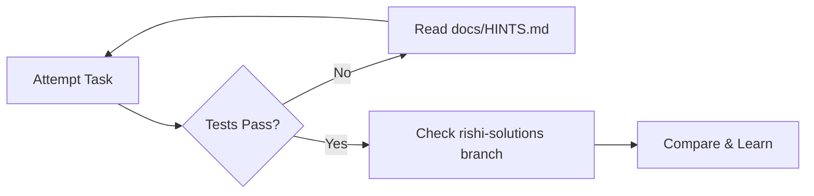
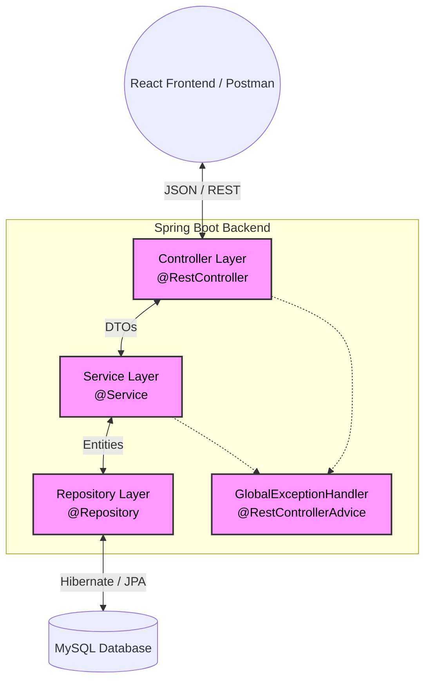

# 🎓 Student Management System - Training Edition

Welcome to the **Student Management System** backend repository! This isn't just an ordinary codebase—this is a custom-built, highly structured interactive Java & Spring Boot learning environment designed exclusively by Rishi, for Khushi.

---

## 👩‍💻 A Message for Khushi

If you're reading this, welcome to your Java backend training ground! 🚀 

This repository simulates a real-world, production-ready Spring Boot application. However, the `main` branch you are currently on has **38 specific features missing** (marked with `// TODO [JAVA-XX]`). 

Your mission is to hunt down these TODOs, write the missing Java code, make the automated tests pass, and bring the application to life. 

Don't worry, you aren't doing this alone. I've built a full workflow for you.

### 🔄 Your Learning Workflow



1. **Attempt:** Find a `[JAVA-XX]` task in the code. Write the implementation.
2. **Test:** Run `.\mvnw.cmd clean test` in your terminal. If it fails, debug it!
3. **Hint:** If you're completely stuck, check the `docs/HINTS.md` file (no solutions, just nudges).
4. **Compare:** Once you've solved it (or if you gave it your absolute best shot and are stuck), switch to the `rishi-solutions` branch. There, you'll find a massive library of detailed explanations explaining exactly *how* I solved it, *why* I did it that way, and what the edge cases are.

---

## 🏗️ System Architecture

This application strictly follows the standard Spring Boot layered architecture to ensure separation of concerns.



---

## 💻 Tech Stack

- **Language:** Java 17+
- **Framework:** Spring Boot 3.x
- **Database:** MySQL 8.x (Production) & H2 (In-memory testing)
- **Data Access:** Spring Data JPA / Hibernate
- **Validation:** Jakarta Bean Validation
- **Boilerplate Reduction:** Lombok
- **Testing:** JUnit 5 & Mockito

---

## 🚀 Getting Started

### Prerequisites
- JDK 17 installed and added to your PATH.
- MySQL installed and running on port 3306.
- A MySQL database created named `student_management_db`.

### Running the Application

1. Open your terminal in the `backend` directory.
2. Update `src/main/resources/application-local.properties` with your MySQL username and password.
3. Start the application:
   ```bash
   .\mvnw.cmd spring-boot:run
   ```
4. Check the API documentation automatically generated for you at: 
   `http://localhost:8080/swagger-ui.html`

### Running the Tests
To verify your work on the tasks, run:
```bash
.\mvnw.cmd clean test
```

---

## ⚖️ License
This repository is strictly protected by an Exclusive Personal Use License. It is intended solely for the educational advancement of Khushi. See `LICENSE` for the complete binding restrictions.
