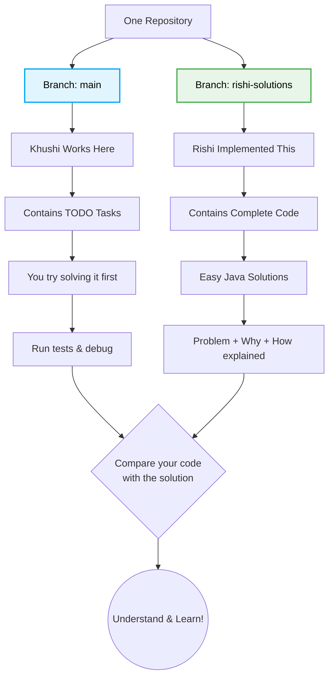
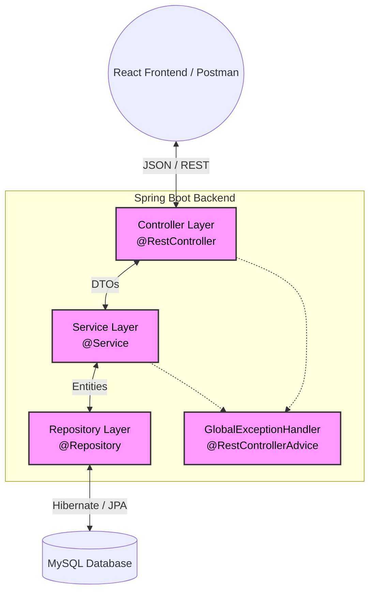

# 👋 Hey Khushi!

Welcome to your first real Java project journey.

You already know Java.
You already understand the language.
Now this project is about something different:

**turning the Java you already know into something that actually works in a real application.**

This repository was prepared so you don't have to figure everything out alone.

You won't be thrown into a huge codebase and told:
"Good luck, figure it out."

Instead, you'll have:

🧩 one task at a time  
📍 the exact file to open  
🔎 the exact method to work on  
🧠 hints when you need them  
🧪 tests to tell you whether your implementation works  
🚀 GitHub Actions to automatically check your code  
📚 complete reference solutions when you're truly stuck

You don't need to be perfect on the first try.
Getting an error is part of development.
A failed test is not failure — it is information telling you what to fix next.

---

## 💙 This project is for YOU

You told me you already know Java really well, but the difficult part was knowing how to take that knowledge and use it inside a real project.

That's exactly what this repository is designed to help with.

You already have the foundation.
Now we're connecting that foundation to:

Java<br>
↓<br>
Spring Boot<br>
↓<br>
Services<br>
↓<br>
Repositories<br>
↓<br>
MySQL<br>
↓<br>
REST APIs<br>
↓<br>
Frontend

The goal isn't just to finish this project.

The goal is to reach the point where you can look at a new project and think:

"I know where to start."

---

# 🚦 START HERE

Before you touch any code, please review your personalized onboarding guides:

1. 🏁 **[Welcome & Instructions](./docs/START_HERE.md)** - *Read this first!*
2. 🐙 **[GitHub & Actions Guide](./docs/GITHUB_FOR_KHUSHI.md)** - *How to push and check your work.*
3. 🗺️ **[Learning Roadmap](./docs/TASK-ROADMAP.md)** - *The exact order to complete tasks.*
4. 📁 **[Quick File Map](./docs/FILE-MAP.md)** - *Where to find specific files quickly.*
5. ✅ **[Progress Tracker](./docs/PROGRESS.md)** - *Mark tasks off as you complete them!*

---

## 🔀 The Dual-Branch Learning System

This repository uses a strict two-branch system designed specifically for your learning. **You will work entirely on `main`.**



1. **Attempt:** Find a `[JAVA-XX]` task in the code on `main`. Write the implementation.
2. **Test:** Run `.\mvnw.cmd clean test` in your terminal. If it fails, debug it!
3. **Compare:** Switch to the `rishi-solutions` branch. There, you'll find a massive library of detailed explanations explaining exactly *how* I solved it, *why* I did it that way, and what the edge cases are.

---

## 🏗️ System Architecture

This application strictly follows the standard Spring Boot layered architecture to ensure separation of concerns.



---

## 💻 Tech Stack

- **Language:** Java 17+
- **Framework:** Spring Boot 3.x
- **Database:** MySQL 8.x (Production) & H2 (In-memory testing)
- **Data Access:** Spring Data JPA / Hibernate
- **Validation:** Jakarta Bean Validation
- **Boilerplate Reduction:** Lombok
- **Testing:** JUnit 5 & Mockito

---

## 🚀 Getting Started

### Prerequisites
- JDK 17 installed and added to your PATH.
- MySQL installed and running on port 3306.
- A MySQL database created named `student_management_db`.

### Running the Application

1. Open your terminal in the `backend` directory.
2. Update `src/main/resources/application-local.properties` with your MySQL username and password.
3. Start the application:
   ```bash
   .\mvnw.cmd spring-boot:run
   ```
4. Check the API documentation automatically generated for you at: 
   `http://localhost:8080/swagger-ui.html`

### Running the Tests
To verify your work on the tasks, run:
```bash
.\mvnw.cmd clean test
```

---

## ⚖️ License
This repository is strictly protected by an Exclusive Personal Use License. It is intended solely for the educational advancement of Khushi. See `LICENSE` for the complete binding restrictions.
